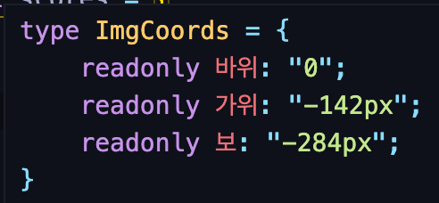
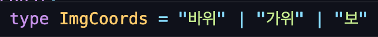
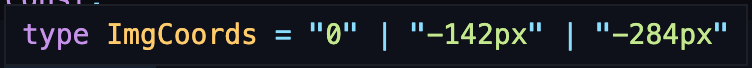

# 🎮 Ts + React Webgame 🎮
React + TS Webgame 실습  
[웹 게임을 만들며 배우는 React에 TypeScript 적용하기 - 인프런 강좌](https://www.inflearn.com/course/react-typescript-webgame#)

 

## 🎱 학습 목표
- React + TypeScript
- DefinitelyTyped
- React Router 타이핑
- Redux 타이핑
- MobX 타이핑

 

## 🎱 학습 내용 (updating...)
### 타입스크립트 학습
- [TypeScript 공식 문서 - Handbook](https://www.typescriptlang.org/ko/docs/handbook/intro.html)
- [TypeScript 공식 문서 - What's New](https://www.typescriptlang.org/docs/handbook/release-notes/overview.html)

1. DefinitelyTyped
    - typescript 지원 커뮤니티
    - react와 react-dom은 타이핑을 지원하지 않기 때문에, 따로 설치해주어야 한다. `@types/react @types/react-dom`

 

2. 타입스크립트 세팅
    - tsconfig.json에 `"esModuleInterop": true,`설정하면, export로 내보내진 React와 ReactDOM을 export default로 내보내진 것처럼 사용할 수 있다.

 

3. `useState([])` 
    - useState에서 빈배열 초기값은 타입이 never가 되는 타이핑 문제를 일으킨다.
    - **useState에 제네릭으로 타이핑 할 것!**

 

4. webpack-cli@4버전 hot reload 설정
    - webpack-cli@4버전 사용 시 명령어가 `webpack-dev-server` 대신에 `webpack serve --env development`로 바뀜

 

5. setTimeout
    - TS사용 시 setTimeout은 자신의 환경을 구분하지 못하기 때문에, 브라우저에서 사용될 시 window로 명시해주어야 한다. 
    - `window.setTimeout`

 

6. ✨useRef
    - useRef는 오버로딩 되어있어, 세가지 방법으로 타입을 정해줄 수 있다.
    - `MutableRefObject`로 지정되어야 useRef에 변수를 할당하여 사용하는 코딩을 할 수 있다.

 

7. `!`
    - 확실한 타입의 변수인데, 타입에러가 생길 경우 | undefined도 되는 경우 `변수!`으로 타입을 확신해준다.

 

8. as const
    - 확실한 값에는 `as const`를 붙여주면, 값이 타입으로 확정된다.

 

9. `type ImgCoords = typeof rspCoords[keyof typeof rspCoords]` 찬찬히 뜯어보기...🍗
    - typeof rspCoords
  
       

    - keyof typeof rspCoords

       

    - typeof rspCoords[keyof typeof rspCoords]

       
      
 

10. `.includes`
    - `.includes`를 사용하려면 tsconfig.json에 `es2016`을 설정해주어야 한다.

 

11. 함수 컴포넌트 타이핑
    - 🚫`SFC` - deprecated 
    - 🚫`StatelessComponent` - deprecated
    > React에서 hook이 들어오면서 함수컴포넌트는 더이상 stateless로 사용되지 않기 때문에, 사용하지 않는다!!

 

12. memo
    - 자식컴포넌트에서 props를 받아올 때 자식컴포넌트에 감싸줌!

 

13. 라우터 타이핑
    - hooks으로 사용할 경우, hooks자체에서 match, history, location props가 들어있기 때문에, props를 넘겨줄 필요가 없다.(간-편)
    - `useLocation, useHistory, useRouteMatch`